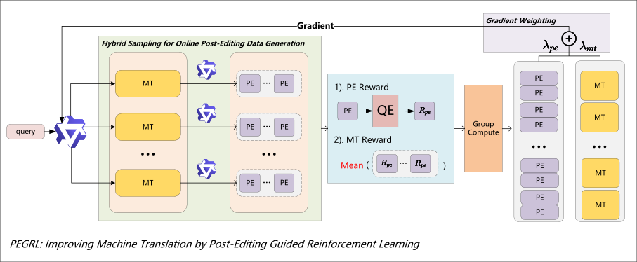

# PEGRL

<div align="center">

<p align="center">
<em>A reinforcement learning framework for improving machine translation via post-editing guidance.</em>
</p>

<br>

<div align="center">
<a href="./assets/pegrl.pdf">
  
</a>

</div>

<br>

[]()
[](https://arxiv.org/abs/2602.03352)
[](https://github.com/NJUNLP/peg-rl)

</div>


## 🎉News
- **[2026/04/06]** 🎉 PEGRL has been accepted to **Findings of ACL 2026**!


## Introduction

**PEGRL** is a two-stage reinforcement learning (RL) framework for machine translation that leverages post-editing as an auxiliary task to stabilize training and guide optimization. While RL has shown strong promise in LLM-based MT (e.g., GRPO), translation-oriented RL suffers from noisy Monte Carlo return estimates and large trajectory spaces, often favoring global over local optimization.

PEGRL addresses these challenges by:

1. **Post-editing as auxiliary supervision** – Translation outputs are sampled to construct post-editing inputs, enabling return estimation conditioned on current translation behavior.
2. **Balancing exploration and local optimization** – Supports global exploration while promoting fine-grained improvements.
3. **Task-specific weighting** – Translation and post-editing objectives are combined with a weighting scheme, yielding a biased yet more sample-efficient estimator.

**Results:** Experiments on English→Finnish, English→Turkish, and English↔Chinese show consistent improvements over standard RL baselines. Notably, English→Turkish COMET-KIWI performance approaches state-of-the-art LLM systems (DeepSeek-V3.2: 68.14 vs. 68.13).

## Environment

Our software environment is based on Python 3.11. The main upper-level Python packages include **verl**, **sacrebleu**, and **unbabel-comet**. You can build the software environment using the following script:

First, install COMET:

```bash
git clone https://github.com/dgme-syz/COMET.git && cd COMET && git checkout feature/support-custom-strategy && pip install -e .
```

Then, prepare the dependencies required for the training framework: 

```bash
USE_SGLANG=0 USE_MEGATRON=0 bash scripts/install_vllm_sglang_mcore.sh
pip install sacrebleu "sacrebleu[ja]" "sacrebleu[ko]" 
```

We provide a Conda environment file for reference. We recommend using the installation script above for setup. The [env.yaml](./env.yaml) file is intended for reference only.

<details>
<summary><strong>Ascend</strong></summary>

For Ascend users, run the following:

```bash
git clone https://github.com/dgme-syz/COMET.git && cd COMET && git checkout feature/support-custom-strategy && pip install -e .
pip install vllm==0.11.0
pip install vllm-ascend==0.11.0rc1
pip install -r requirements-npu.txt
pip install -e .
pip install sacrebleu "sacrebleu[ja]" "sacrebleu[ko]"
```

</details>

## Model

The project uses both **policy models** and **external reward models**. For policy models, we recommend creating symbolic links under the [models](./models) directory. External reward models include **COMETKiwi** and **XCOMET** (we recommend managing COMET models using `$HF_HOME`):

```bash
ln -sfn path/to/your/locate/model models/Qwen3-0.6B
ln -sfn path/to/your/locate/model models/Qwen3-4B
ln -sfn path/to/your/locate/model models/Qwen3-8B
```

Make sure you know the location specified by the `HF_HOME` environment variable:

```bash
hf download Unbabel/wmt23-cometkiwi-da-xl
hf download Unbabel/XCOMET-XL
```

If `hf download` is used **without** specifying the `--local-dir` parameter, you do not need to manually set the COMET model path. Otherwise, if you:

* Want to use additional COMET models, or
* Need to specify a custom local path for COMET models,

please refer to [comet.yaml](verl/trainer/config/comet_model/comet.yaml).

> [!TIP]
> In multi-GPU settings, using many COMET models is not recommended. The current implementation loads one COMET model per GPU, which can consume a large amount of memory even before the models are invoked.

## Data

Simply place the folder from the [link](https://box.nju.edu.cn/d/e995f4928b1948acaf4d/) into the project root directory, i.e.:

```
project-root/
├── data/
│   ├── train/
│   ├── test/
│   └── ...
├── verl/
└── scripts/
```

## Scripts

All experiment scripts are organized by category under [train_scripts](./train_scripts). The `main` subdirectory contains the primary experiments, `ablation` contains the main ablation studies, and `weight` contains weight analysis experiments. All scripts should be executed from the project root directory. For example:

```bash
bash train_scripts/main/train_0_4B_en2fi_ours.sh
# Or ascend
bash train_scripts/main_ascend/train_0_4B_en2fi_ours.sh
```

For the experiment scripts, you may adjust two per-GPU batch parameters based on the available GPU memory:

* `ppo_micro_batch_size_per_gpu`:

  * 32 for A6000 (48G)
  * 64 for A100 (80G)
  * 128 for H20 (96G)
* `forward_micro_batch_size` (in [comet.yaml](verl/trainer/config/comet_model/comet.yaml)):

  * 64 for A6000 (48G)
  * 128 for A100 (80G), H20 (96G)

Other parameters, such as project/experiment naming and model checkpoint saving frequency, **can be modified if necessary, but changes beyond these are not recommended**.


## Q&A

If you have any questions or run into issues, please feel free to open an issue for discussion. You can also reach me at **[shenyunzhi@smail.nju.edu.cn](mailto:shenyunzhi@smail.nju.edu.cn)**.

## Citation

If you find this repository useful, please consider citing:

```bibtex
@misc{shen2026pegrlimprovingmachinetranslation,
  title={PEGRL: Improving Machine Translation by Post-Editing Guided Reinforcement Learning},
  author={Yunzhi Shen and Hao Zhou and Xin Huang and Xue Han and Junlan Feng and Shujian Huang},
  year={2026},
  eprint={2602.03352},
  archivePrefix={arXiv},
  primaryClass={cs.CL},
  url={https://arxiv.org/abs/2602.03352}
}
```

## Acknowledgments

Our codebase is built upon the work of [MT-R1-Zero](https://github.com/fzp0424/MT-R1-Zero) and [Verl](https://github.com/verl-project/verl). We extend our sincere thanks to their projects.


